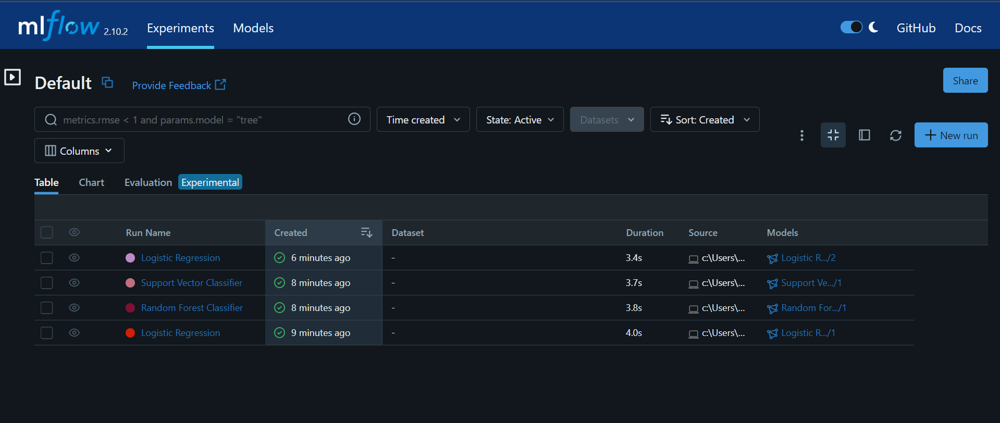

# Experiment Tracking

## Data Version Control with DVC
Steps in `prepare.ipynb` file.
### System setup
#### Initialization
- `!dvc init --subdir`: Initialize DVC in subdirectory ".dvc".
- `!git init`: Initialize the git repository.
#### Commit Initialization
- `!git status` : Check the status which files are modified and tracked.
- `!git commit -m "DVC initialised"` : Commit the dvc initialization.
#### Set the remote storage
- `!dvc remote add -d remote_storage gdrive://10erQZzAuN836exH6vS-VsMSXd0dJytwt -f` : Set the google drive as the remote storage to store different versions of the data.
- `!git add .dvc/config`: Add the modified file to git.
- `!git status`: Check the status of the files.
- `!git commit -m "Updated remote storage"`: Commit the changed remote storage to git.

### Data Processing
- Define a function to clean and preprocess the data.
- Define a function to split the dataset into `train`, `validation` and `test` datasets with unique random seed.
- Load the dataset and call the function to preprocess.
- Call the function to split the dataset.
- Save the 3 datasets in the prepared data folder as `.csv` files.

### Data Versioning and Tracking
- Add the `.csv` files to dvc and add the `.csv.dvc` files to git.
- Commit the changes to git and push to dvc.
- Repeat the steps to split the dataset with new random seed to get the new version of the data.
- Add to git and dvc, commit changes to git, and push to dvc.

### Checkout the versions
- `!git log`: Check the git history.
- `!git checkout`: Checkout the files from specific git commits.
- `!dvc checkout`: Restore that specific version od the data.
- Read the restored version of the data and analyze the distribution of the target variable.
- Repeat the steps to analyze the distribution of different versions of the data.

## Model Version Control and Experiment Tracking with ML Flow
- Train the 3 benchmark models.
- Run and track the models in MLFlow.

